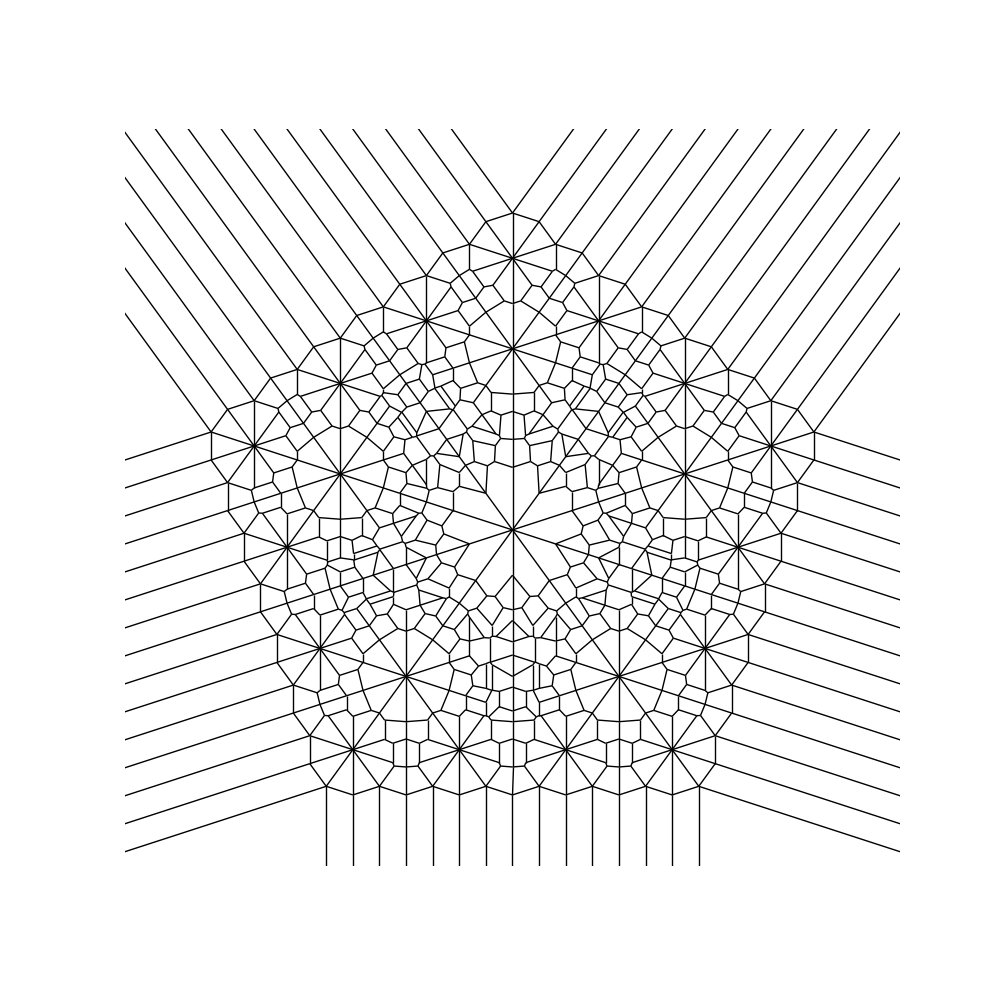
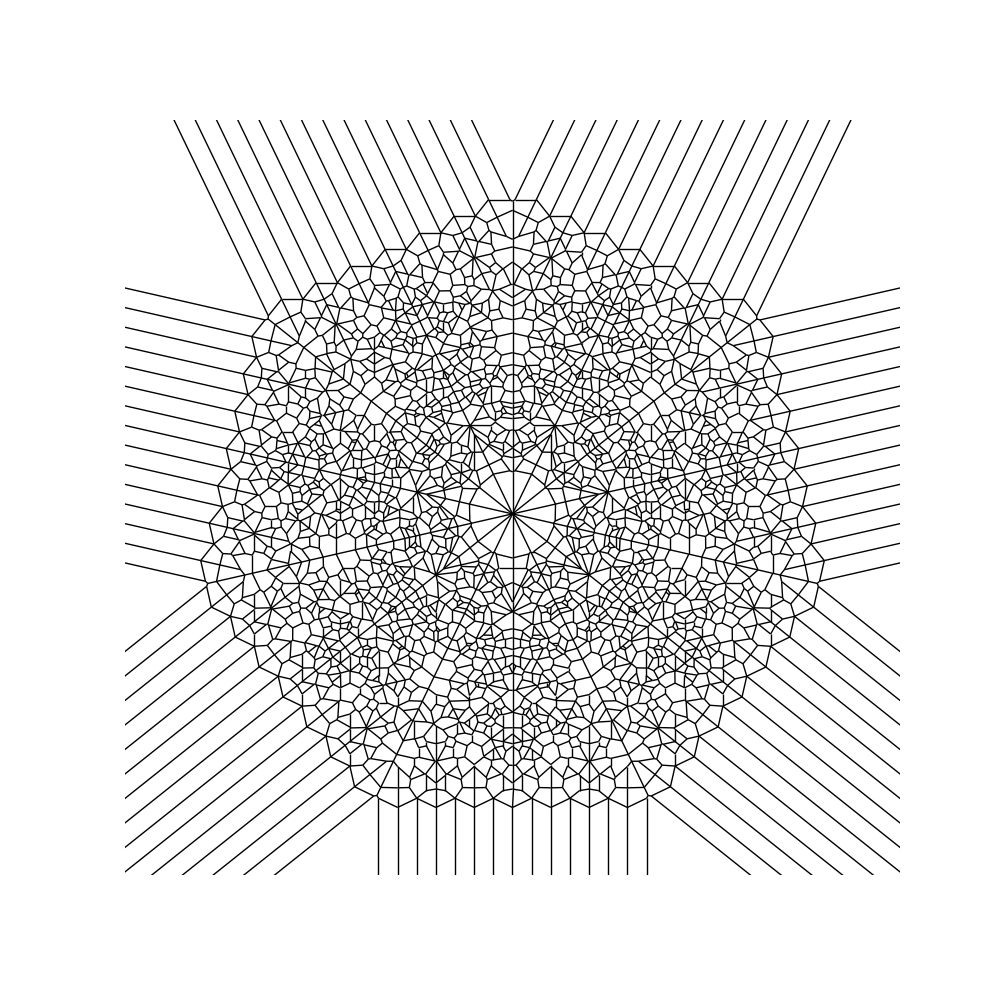

# Mandalapy
This is a Python port of Anotonio Sanchez's R code: https://fronkonstin.com/2018/02/14/mandalas/
Part of this code was used as a tutorial for spatial data structures and algorithms with SciPy: https://docs.scipy.org/doc/scipy/reference/tutorial/spatial.html

Enjoy making beautiful mandalas modifying the specified parameters to obtain different figures.

## Installation

- Checkout the repository
- Make sure you have python 3.7+ installed and a virtual environment manager for python
- Create a virtual environment using [virtualenvwrapper](https://virtualenvwrapper.readthedocs.io/en/latest/command_ref.html) or any manager of your preference
- Install the requirements with `pip install requirements`

 ## Usage
 To use the code, just clone the repository into your computer. 
 The file mandalapy.py contains the main function to draw the figures.
 In case you want to play with the code directly into jupyter, you can use the mandalapy_notebook.ipynb file. 
 
 ## Examples
 Created with 4 iterations, 5 points and radius 2:
 
 Created with 4 iterations, 7 points and radius 2:
 
 
 
